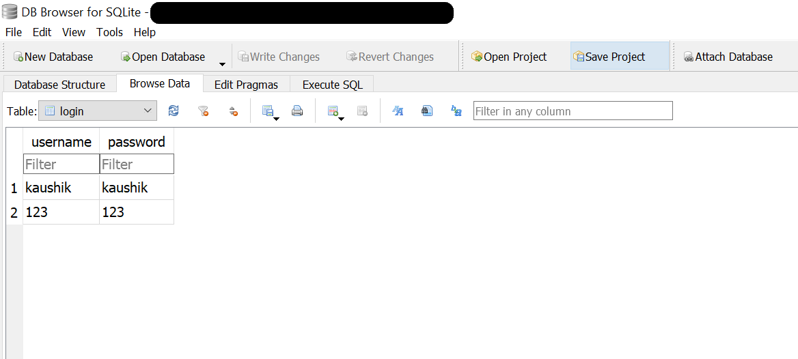
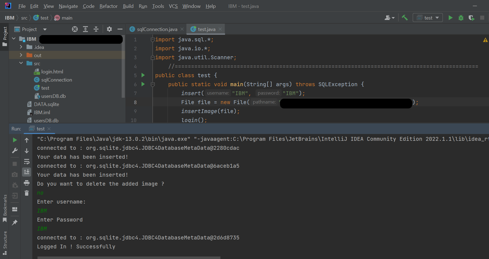
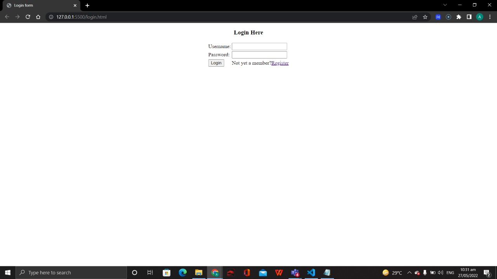
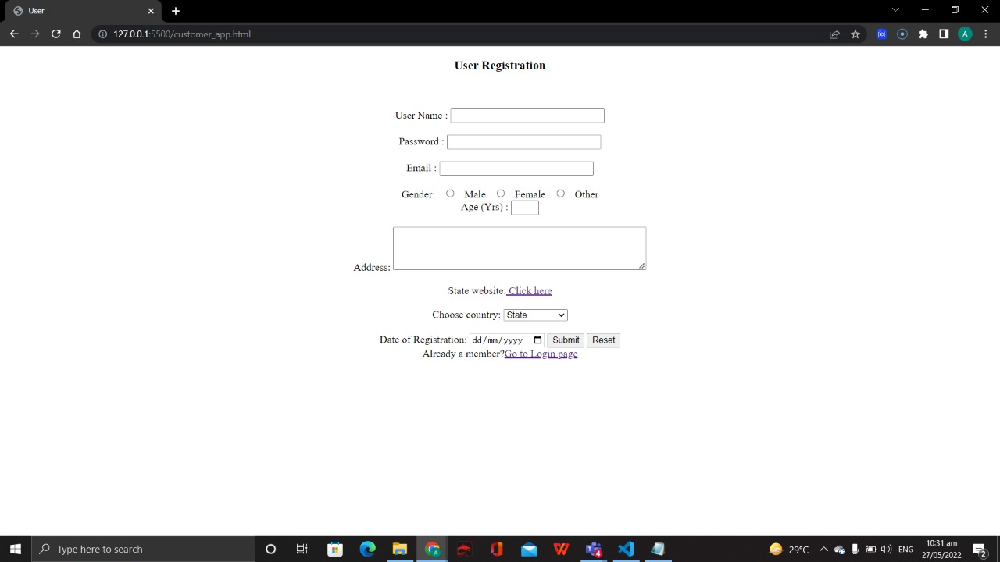

# 2022_IBM_Code_Challenge_Digitization_Project
    
#### Table of Contents
1. [Project Description](#project-description)
2. [SOlution Description](#solution-description)
3. [Contributor's](#contributor's)

## Project Description
* This project is a part of IBM's Good Tech Scholar Program. We chose the problem statement -"Digitization to ease access to social services". The idea is to make Indian governmental services accessible to common people via an interface like mobile app/ web application.

## Solution Description
* Our team tried to create an all-in-one web application which gives users the ease of accessing all the governmental services like -"Land conversion", "Pension application" etc.. For storing the data, we have used sqlite database software. We have used JDBC driver inorder to make a connection between Java & the database software.

## Contributor's
* Kaushik Ramabhotla
* A P Advaith
* Modiyam Sandhya
* Palla Narasimha
* Adithya Raj Melayikandy

## Application video:
* https://youtu.be/qLXZ11rm5w4

## Gallery:

